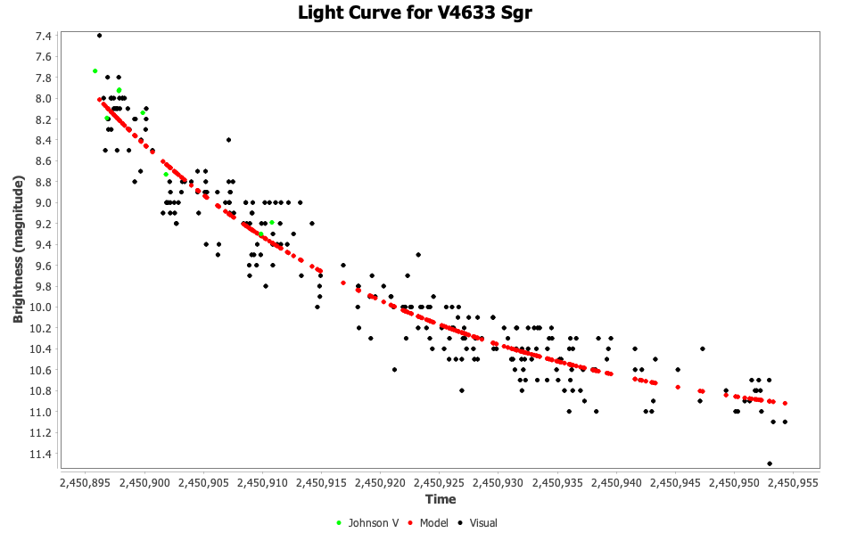

# Nova Exponential Decline Model

The **Nova Exponential Decline Model** fits the early decline of a nova
outburst with the function used by Kok (2010), equation (10):

$$
m(t) = P_1 - P_2 e^{-P_3(t-t_0)}
$$

This plug-in appears in VStar's **Analysis** menu as **Nova
Exponential Decline Model**. The same model is also used internally by the
MMRD nova distance calculator when the **Exponential model fit (Kok 2010,
eq. 10)** source is selected.

## Parameters

| Parameter | Meaning |
|-----------|---------|
| $P_1$ | asymptotic post-outburst magnitude |
| $P_2$ | outburst amplitude above the asymptote |
| $P_3$ | decline rate in inverse days |
| $t_0$ | fit origin, taken to be the JD of the brightest observation |

The model is fitted by non-linear least squares using a Levenberg-Marquardt
optimizer. The fit is applied to observations from the brightest observation
onward.

The **Analysis** > **Models** dialog shows the fit as a VeLa function.
 
## Decline Times

The model has a closed-form crossing time. For a decline of $\Delta$
magnitudes from reference maximum $m_0$:

$$
t_\Delta = \frac{\ln(P_2 / (P_1 - m_0 - \Delta))}{P_3}
$$

This is not a separate model: it is equation (10) rearranged. Setting
$m(t) = m_0 + \Delta$ and solving for $t - t_0$ inverts the exponential, which
is why the forward model (and the VeLa function shown in the **Models** dialog)
uses $e^{-P_3(t-t_0)}$ while the crossing time uses a logarithm and a division.
$t_\Delta$ is therefore the elapsed time from the fit origin $t_0$.

The MMRD calculator uses this to compute:

- $t_2$, where $\Delta = 2$
- $t_3$, where $\Delta = 3$

When the model is run directly from the **Analysis** menu, the model
series is added to the plot and can be inspected like other VStar models.

## Relationship to MMRD Calculator Plug-in

The MMRD nova distance calculator plug-in uses this model to smooth noisy nova
decline data before extracting $t_2$ and $t_3$. This is especially useful for
raw visual observations from AID, where direct crossing detection can be
misled by scatter.

For Kok-style MMRD testing:

1. Load the nova observations over the same JD window used in the paper.
2. Fit the exponential model.
3. Measure $t_2$ and $t_3$ from the fitted curve relative to the observed or
   chart-read maximum.
4. Use those values in the MMRD nova distance calculator.

## Uncertainties

The fit produces parameter uncertainties when the optimizer can estimate them.
When this model is used as the decline-time source in the MMRD nova distance
calculator, those uncertainties are propagated through the closed-form crossing
time to populate the calculator's $\sigma t_2$ and $\sigma t_3$ fields. The full
error-bar pipeline (decline times to absolute magnitude to distance bounds) is
documented with the MMRD nova distance calculator plug-in.

The parameter uncertainties are used for that propagation only; they are not
shown in the **Models** dialog.

## Fit Metrics

Like other VStar models, the fit reports three standard goodness-of-fit
metrics, computed for the three estimated parameters $P_1$, $P_2$, $P_3$:

- **RMS** &mdash; the root-mean-square of the residuals about the fitted curve.
  This is a direct measure of how closely the model follows the observed
  decline; a large RMS relative to the photometric scatter suggests the
  exponential form or the chosen JD window is a poor fit.
- **AIC** and **BIC** &mdash; the Akaike and Bayesian Information Criteria.
  These are intended for *comparing competing fits of the same data* (for
  example this model against another model series). Their absolute values are
  not meaningful in isolation; lower values indicate a better
  complexity-penalised fit when comparing alternatives.

These metrics describe overall fit quality and are distinct from the parameter
covariance used above: RMS/AIC/BIC summarise how well the curve matches the
data, whereas the covariance is what propagates into the $\sigma t_2$ and
$\sigma t_3$ (and ultimately the MMRD distance) uncertainties.

## When to Use This Model

Use this model when:

- the nova has a reasonably smooth decline after maximum,
- you need $t_2$ and $t_3$ for MMRD distance estimation,
- raw observations are too noisy for direct peak+2/peak+3 crossing detection,
- you want a visible model series for inspection before running the MMRD tool.

## Limitations

- The model is empirical and intended for the early decline phase.
- It requires enough post-maximum observations to constrain three parameters.
- If the fitted amplitude does not reach peak + 2 or peak + 3 magnitudes, the
  corresponding $t_2$ or $t_3$ is unavailable.
- The fit origin is the brightest observation, so a spurious bright point can
  affect the model. Review the input data and filters before fitting.

## Reference

Kok, Y. 2010, *Absolute Magnitudes and Distances of Recent Novae*, JAAVSO,
38, 193.
